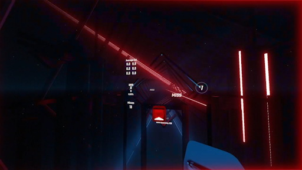

# Miss Fx
HTML code for OBS browser source to effects by detecting Beat Saber events via HttpSiraStatus.
Miss Fx provides the visual effect of red damage-like frame and the sound effect of your choise when a miss occurs.

The red frame below shows up when miss occurs, and will fade out soon.


The visual effect is a copycat of [the system](https://note.com/human_pipit6071/n/n5e4604175683) created by [Bunkai-san](https://x.com/bunkaiotoko) and operated mostly in Beat Saber tournaments or events in Japan like JBSL.

# How to install
## Beat Saber side
Ensure that you have HttpSiraStatus mod in your Beat Saber environment.
https://github.com/denpadokei/HttpSiraStatus

## OBS side
Put these files or whole directory to your local disk.
- `missfx.html`
- `data.js`
- `sounds/`

Set options by editing them.
See details for the following section.

Then add a browser source in your OBS and specify the html file above as a "local file".
Fit the width and height of the source to your OBS canvas size to have a good result.

# Options
You can configure options in both `*.html` and `data.js` file.
It doesn't matter which one you use, but you can't declare the same parameter in both files.
In the .html file, the area at the top labeled `Options` is where you can make settings. Be careful not to edit anywhere else.
The followings are the main options.

- `WS_URL_DEFAULT`: Websocket address where your HttpSiraStatus in Beat Saber exports the data. (Default: `ws://127.0.0.1:6557/socket`)
- `VISUAL_FX_DEFAULT`: Set `true` to show the visual effect when miss in game, otherwise `false`. (Default: true)
- `SOUND_FX_DEFAULT`: Set `true` to show the sound effect when miss in game, otherwise `false`. If both visual and sound were set to `false`, you can see/feel no effects. (Default: true)
- `DEBUG_DEFAULT`: Set `true` to show a small status window for debug use. (Default: false)
- `AUDIO_URLS`: Sound files to play for miss sound effect.

# Sound file
We have 2 ways to prepare the sound file.

1. Put the mp3 file(s) in `sounds` directory, then set the relative path to `AUDIO_URLS` option.

   ```
   (ex)
    const AUDIO_URLS = [
      "sounds/miss1.mp3",
      "sounds/miss2.mp3"
    ];
   ```

   This is an easy way and is recommended but note that it doesn't work in most browser environment because of the security policy.
   Try in your embedded OBS browser source. It is working if you see the volume meter of the source working.

1. Directly embed the base64 encoded text in `AUDIO_URLS` option.
   Base64 text should follow `data:audio/mp3;base64,` without no space.

   ```
   (ex)
    const AUDIO_URLS = [
      "data:audio/mp3;base64,//uwTA......"
    ];
   ```

   This option might be tooooo long to write in the head of .html file because it contains the entire mp3 data.
   That why it is a good way to declare only this option at the separated file `data.js`.
   Make sure to remove or comment out the`AUDIO_URLS` option in `.html` file if you declare it at `data.js` to avoid the duplicate declaration.

# How to dev
Open the .html file in your browser with debug mode on by setting query parameter `debug=1` or setting `DEBUG_DEFAULT` option to true.
Then press `F12`, it is your dev env.

You can emulate miss event by pressing keyboard 'L', 'R', 'M'.

Make sure that prepare the sound file with #2 way since the security settings of default browser launch doesn't allow playing sound from subdirectory.
