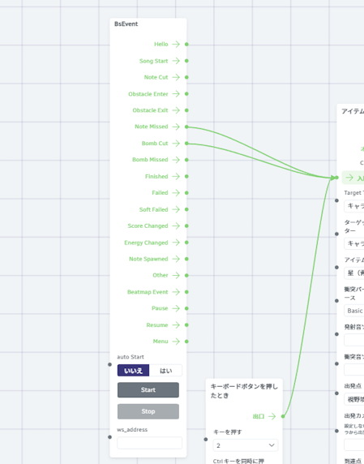

# BsEvent
Warudo plugin to detect Beat Saber events via HttpSiraStatus.

# How to install
## Beat Saber side
Ensure that you have HttpSiraStatus mod in your Beat Saber environment.
https://github.com/denpadokei/HttpSiraStatus

## Warudo side
Put the following files into Warudo Playground directory.
- `bsevent.cs`

You can find the `Playground` directory in your Warud data folder. (Menu → Open Data Folder)

If you want the `.dll` style mod, you need to setup your building environment and build them by yourself since we have no plan to provide it so far.

This plugin provides a new node.
You can find and add the `BsEvent` node to your blueprint.
Connect the output flow pin that you would like to react to your favourite action.

# Options
- `ws_address`: Leave empty if not required. If you set your HttpSiraStatus to export the data with the different websocket address from default, fill that address. (Default: `ws://127.0.0.1:6557/socket`)
- `Start` button, `Stop` button: Start/stop the websocket access to the Beat Saber port. You don't need to press these buttons manually when you enable the `auto start` option below.
- `auto start`: Option to start the websocket access automatically. If detected errors like when the Beat Saber is not launched yet or disconnected unexpectedlly, it will try to connect several seconds later again and again. (Default: `false`)

# How to dev
Follow the Warudo instructions to setup environment for development.
https://docs.warudo.app/jp/docs/scripting/creating-your-first-script

- Put the `.csproj` file from Warudo webpage and `*.cs` files above into Playground directory.
- Use VSCode and open the Playground directory.
